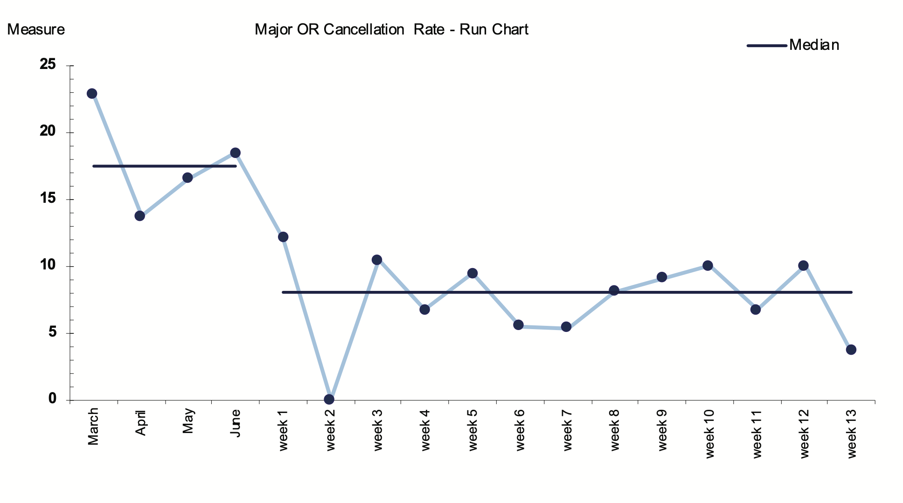
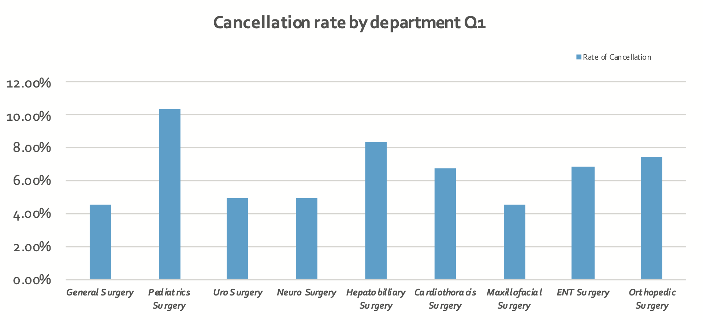

# Reducing Elective Surgery Cancellations – A Quality Improvement Project

**Setting:** Menelik II Hospital, Major OR | Duration: 3 months  
**Tools Used:** Excel, PDSA Cycle, Root Cause Analysis, Visual Dashboards

## 🩺 Problem
High same-day cancellation rates (median 17.5%) disrupted patient care and resource utilization.

## ⚙️ Methods
- Applied Model for Improvement & PDSA Cycles
- Built multidisciplinary QI team
- Developed Excel-based daily dashboards and cancellation trackers
- Conducted stakeholder engagement and systemic workflow reform

## 📈 Results
- Cancellation rate reduced from 17.5% to 7.2%
- Increased OR utilization, decreased waiting time
- Strengthened team communication and documentation

## 🧩 Lessons Learned
- Simple Excel dashboards and team ownership can drive change
- Daily data visibility encourages accountability
- Change management in clinical systems is complex but scalable

## 📁 Files
- 📊 Excel Dashboard (dummy version)
- 📄 Full QIP PDF (as published)
- 🖼️ Visuals: Run chart & driver diagram

---
*This project is a real-world example of applying healthcare management tools to drive measurable outcomes without code—ideal for health economics and QI roles.*
[Dummy_OR_Report.xlsx](./Dummy_OR_Report.xlsx) – Simulated OR productivity data for QIP visualization

 
